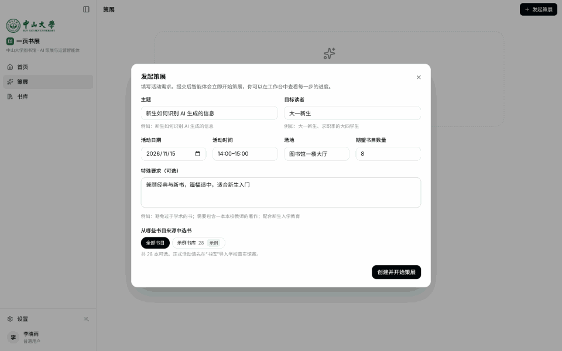
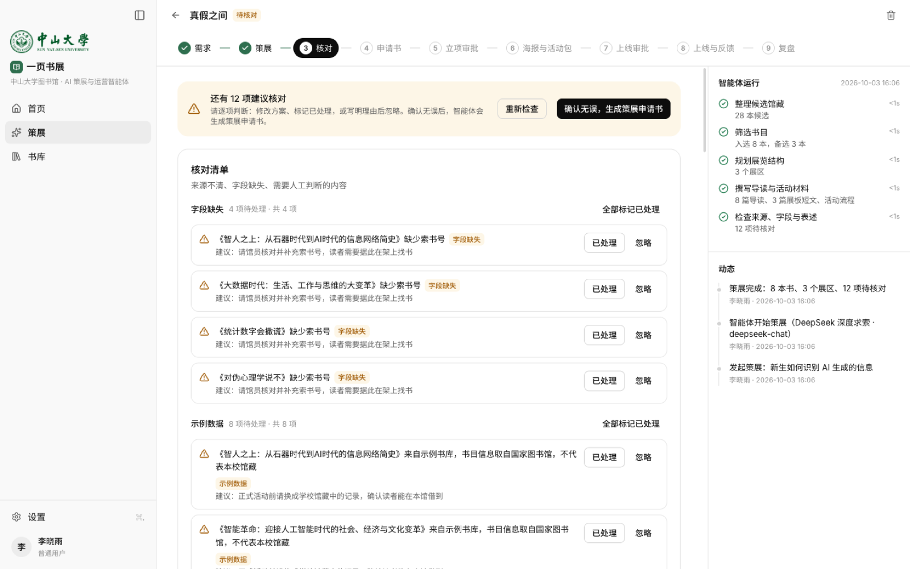
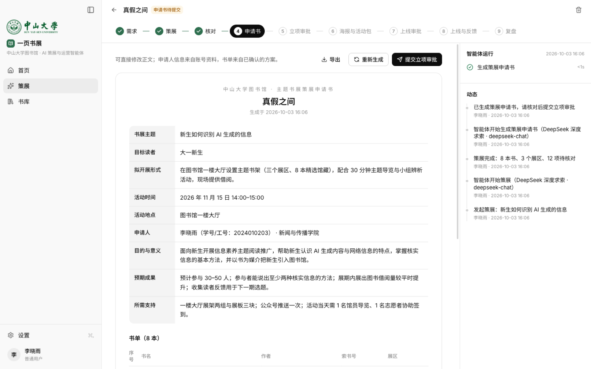
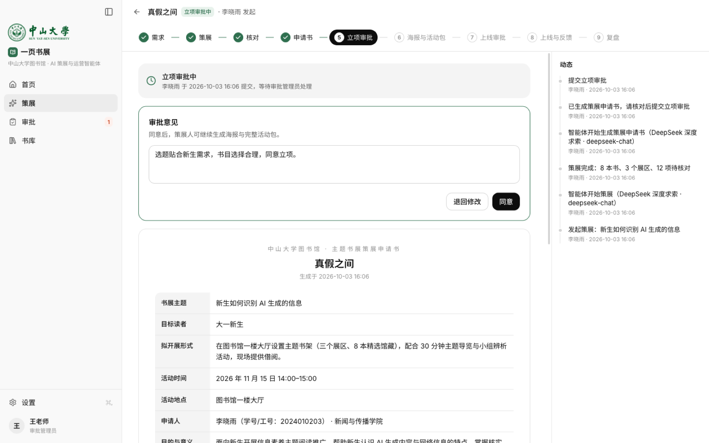
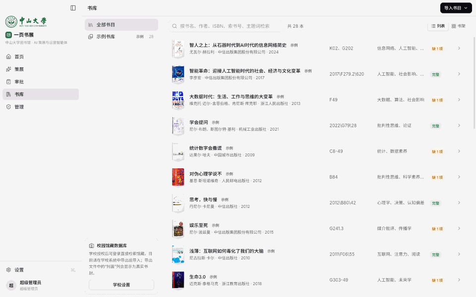
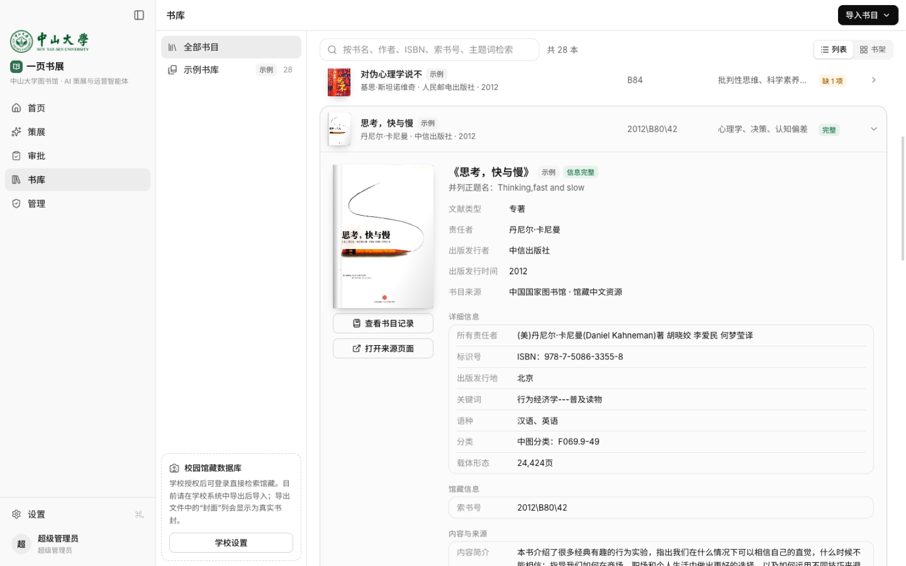
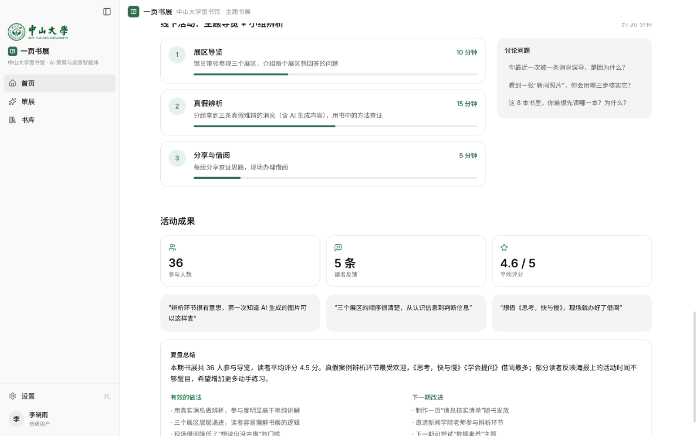
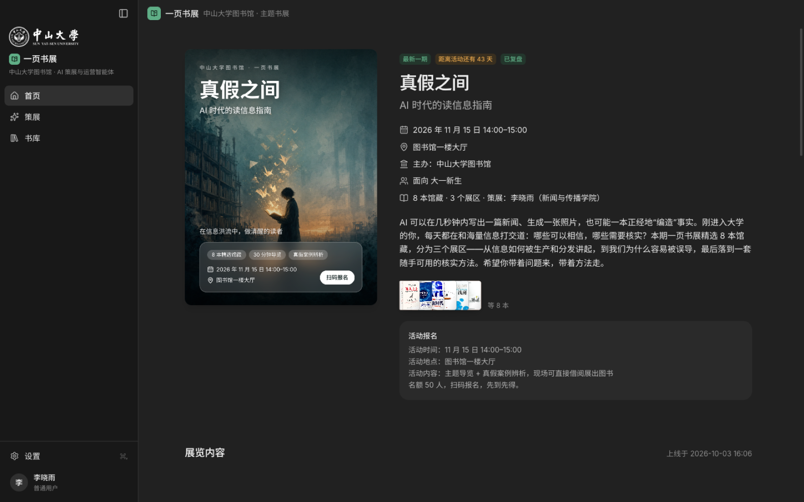
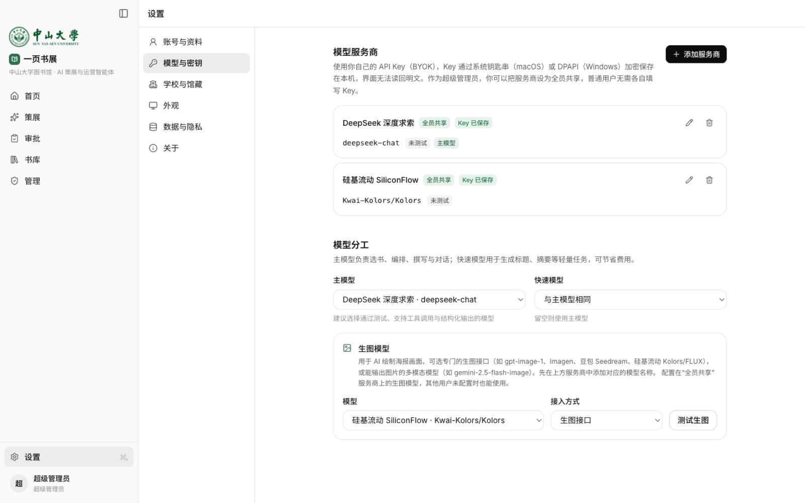
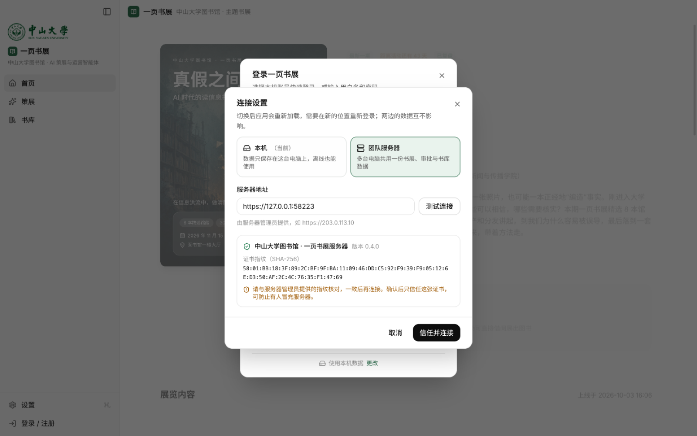

# 一页书展

面向高校图书馆阅读推广的 AI 策展与运营智能体。桌面客户端（macOS / Windows 功能一致），支持自带模型 Key（BYOK），既可单机使用，也可连接团队服务器多人共用一份数据。

<p align="center">
  
</p>

## 界面预览

### 九步策展工作流

从填写需求到智能体策展、核对清单、申请书、两轮审批、海报与活动包，到上线后的反馈与复盘：

<p align="center">
  
</p>

| 智能体策展与核对清单 | 策展申请书 |
| :---: | :---: |
|  |  |
| **审批：同意或退回修改** | **AI 绘制海报画面与完整活动包** |
|  |  |

### 书库

实体书封面、按国家图书馆书目详情展示的著录信息，列表与书架两种视图：

<p align="center">
  
</p>

| 书目详情（ISBN、中图分类号、载体形态、索书号） | 书架视图 |
| :---: | :---: |
|  |  |

### 首页、设置与团队服务器

| 活动成果（参与人数、评分、复盘） | 深色模式 |
| :---: | :---: |
|  |  |
| **模型与密钥：BYOK，可单独接入生图模型** | **连接团队服务器：核对证书指纹** |
|  |  |

> 截图由 `pnpm --filter @yys/desktop showcase` 自动生成：用演示脚本代替真实模型，走完一期完整书展（`apps/desktop/e2e/showcase.spec.ts`）。

## 功能

- **以书展为中心的九步工作流**：需求 → 智能体策展 → 核对清单 → 策展申请书 → 立项审批 → 海报与活动包 → 上线审批 → 上线与反馈 → 复盘。
- **三类角色**：普通用户（注册即是）、审批管理员、超级管理员；支持记住密码、一键切换账号。
- **书库**：实体书封面、按国家图书馆书目详情结构展示的著录信息；CSV / TSV / TXT / Excel / JSON 导入，预留校园馆藏数据库接口。
- **防编造**：智能体只能从书库候选中选书，规则检查与模型核验结合，生成核对清单。
- **AI 海报**：可单独接入生图接口或多模态模型，画面不含文字，由模板排版标题、时间与地点。
- **首页**：展示最近一期上线的书展、活动预告与成果。
- **团队服务器**：多台电脑共用书展、审批与书库数据；HTTPS + 证书指纹固定，API Key 加密保存在服务器。

## 下载

在 [Releases](https://github.com/yyyyysr/lib-agent/releases/latest) 中下载最新版本：

| 系统 | 安装包 |
| --- | --- |
| macOS（Apple 芯片 M1/M2/M3/M4） | `YiyeShuzhan-<版本>-mac-arm64.dmg` |
| macOS（Intel 芯片） | `YiyeShuzhan-<版本>-mac-x64.dmg` |
| Windows 10/11（x64，绝大多数电脑） | `YiyeShuzhan-<版本>-win-x64.exe` |
| Windows（ARM，如 Surface Pro X） | `YiyeShuzhan-<版本>-win-arm64.exe` |

安装包暂未做代码签名：macOS 首次打开会被拦截，在“系统设置 › 隐私与安全性”中点“仍要打开”（提示“已损坏”时在终端执行 `xattr -dr com.apple.quarantine /Applications/YiyeShuzhan.app`）；Windows 出现“Windows 已保护你的电脑”时点“更多信息 › 仍要运行”。

## 架构

```
桌面客户端（Electron）
├── 界面（React）  ──MessagePort──┐
├── 主进程：窗口、系统钥匙串、媒体协议、连接管理
└── 后台服务（utilityProcess）◄────┘  单机模式：SQLite 在本机
                     或
                 ──WSS（固定证书）──► 团队服务器（Node.js）：同一套后台服务，SQLite 在服务器
```

界面与后台服务之间是同一套 RPC 协议：单机模式经 MessagePort 直连本机后台服务；服务器模式由主进程把同样的消息转发到服务器的 WebSocket，界面代码不区分两种模式。

| 目录 | 内容 |
| --- | --- |
| `apps/desktop` | Electron 客户端：主进程、preload、界面、E2E 测试 |
| `apps/server` | 团队服务器：HTTPS、WebSocket RPC、加密密钥库、限流 |
| `packages/core` | 后台服务：登录与权限、书展工作流、模型与生图、RPC 分发（客户端与服务器共用） |
| `packages/agent-core` | 智能体：策展流水线、检查、文档生成 |
| `packages/llm-gateway` | 模型接入：服务商预设、连接测试、生图 |
| `packages/book-sources` | 书目导入、示例书库、校园接口适配 |
| `packages/db` | SQLite 存储（Node 内置 `node:sqlite`，无原生依赖） |
| `packages/shared` | 类型、schema 与协议定义 |
| `deploy` | 服务器部署脚本与 systemd 服务 |

## 开发

需要 Node.js 24+ 与 pnpm 11。

```bash
pnpm install
pnpm dev              # 启动桌面客户端（开发模式）
pnpm typecheck
pnpm test             # 单元与集成测试
pnpm --filter @yys/desktop e2e   # Electron E2E（含连接服务器的用例，需要 openssl）
```

内置超级管理员：单机模式为 `super_user` / `12345678`，首次登录后会要求修改；服务器模式的初始密码随机生成（见下文）。

## 打包客户端

```bash
pnpm sample:covers    # 下载示例书库封面（随安装包附带，离线可用）
pnpm dist:mac         # 或 pnpm dist:win
```

产物在 `apps/desktop/release/<版本>/`。未配置代码签名证书时生成未签名包，macOS 首次打开需在“系统设置 › 隐私与安全性”中点“仍要打开”。

## 部署团队服务器

服务器需要 Linux（已在 Ubuntu 26.04 验证）、可 sudo 的账号，以及 SSH 公钥登录。4 核 4G 的服务器足够测试与演示使用。

```bash
deploy/deploy.sh ubuntu@<服务器IP>          # 默认 443 端口；第二个参数可指定其他端口
```

脚本会：从国内镜像安装 Node.js 24（校验 SHA-256）、创建专用系统账号、为服务器 IP 生成自签名证书、安装并启动 systemd 服务，最后输出**证书指纹**。

- **初始管理员密码**：随机生成，保存在服务器 `/var/lib/yiyeshuzhan/initial-admin-password.txt`（`sudo cat` 查看），首次登录后会要求修改。也可在 `/etc/yiyeshuzhan/server.env` 中设置 `YYS_ADMIN_PASSWORD`（须在首次启动前）。
- **客户端连接**：登录框底部或“设置 › 数据与隐私 › 连接”中选择“团队服务器”，填写 `https://<服务器IP>`，点“测试连接”，**与部署时输出的证书指纹核对一致**后点“信任并连接”。
- **防火墙**：云服务器需在控制台的防火墙 / 安全组中放行对应 TCP 端口。
- **运维**：`sudo journalctl -u yiyeshuzhan -f` 查看日志；数据都在 `/var/lib/yiyeshuzhan`（数据库、生成的图片、加密的 API Key、主密钥、证书），备份这个目录即可；再次运行 `deploy.sh` 即更新到当前版本。

### 安全设计

- 客户端只信任首次确认过的那张证书（固定证书 + 指纹双重校验），没有域名、使用自签名证书时也能防止中间人冒充服务器。
- 服务商 API Key 经 RPC 写入服务器，以 AES-256-GCM 加密保存，任何客户端都读不回明文；“记住密码”只保存在各自电脑的系统钥匙串中。
- 服务器不向客户端返回初始管理员密码；登录 / 注册按 IP 限流，单个账号连续输错会被临时锁定；拒绝浏览器发起的跨站 WebSocket 连接。
- systemd 服务以专用账号运行，只能写数据目录（`ProtectSystem=strict` 等加固选项）。

## 示例数据与第三方内容

- 示例书库的 ISBN、出版信息、著录字段与内容简介取自中国国家图书馆“文津”书目记录与豆瓣读书，仅用于演示；馆藏地点与在架状态不代表任何学校的真实馆藏。
- 国图索书号需在能访问国图 OPAC 的网络下运行 `pnpm sample:callnumbers` 获取。
- 示例书封面版权归各出版方所有，不包含在本仓库中，打包前由 `pnpm sample:covers` 下载。
- 中山大学校徽为中山大学所有，仅用于默认学校的展示，不在本项目的开源许可范围内；部署到其他学校时可在“学校与馆藏”中修改学校信息。

## 许可证

[MIT](LICENSE)
