# 一页书展 使用手册

版本 0.4.0 · 适用于 macOS 与 Windows

> 一页书展是面向高校图书馆阅读推广的 AI 策展助手：你告诉它想办一期什么主题的书展，它从书库中挑书、编排展区、写导读和海报文案，再经过审批，把书展发布到首页，活动结束后还能帮你整理反馈、写复盘。

---

## 目录

1. [认识一页书展](#一认识一页书展)
2. [下载与安装](#二下载与安装)
3. [本机使用：从零开始办一期书展](#三本机使用从零开始办一期书展)
4. [连接团队服务器](#四连接团队服务器)
5. [常见问题](#五常见问题)

---

## 一、认识一页书展

### 1. 两种使用方式

| 方式 | 适合 | 数据保存在 |
| --- | --- | --- |
| **本机** | 一个人试用、比赛演示、图书馆的一台共用电脑 | 这台电脑上，离线也能用 |
| **团队服务器** | 多位老师和同学在各自电脑上协作（有人策展、有人审批） | 服务器上，所有人看到同一份数据 |

两种方式可以随时切换，彼此的数据互不影响。第一次打开时默认是“本机”。

### 2. 三种角色

| 角色 | 能做什么 |
| --- | --- |
| **普通用户** | 浏览首页书展；发起策展、生成申请书和活动材料；录入反馈与复盘。新注册的账号都是普通用户。 |
| **审批管理员** | 普通用户的全部功能，外加“审批”：对立项和上线进行同意或退回。 |
| **超级管理员** | 全部功能，外加“管理”：给账号分配角色、停用账号；配置所有人共用的大模型。 |

### 3. 一期书展的九个步骤

```
① 需求 → ② 智能体策展 → ③ 核对清单 → ④ 策展申请书 → ⑤ 立项审批
                                                         ↓
      ⑨ 复盘 ← ⑧ 上线与反馈 ← ⑦ 上线审批 ← ⑥ 海报与活动包
```

每一步都在书展页面顶部的步骤条上显示，点击已完成的步骤可以回看。

---

## 二、下载与安装

打开 <https://github.com/yyyyysr/lib-agent/releases/latest>，按自己的电脑下载对应的安装包：

| 你的电脑 | 下载这个文件 |
| --- | --- |
| Mac，芯片是 Apple M1/M2/M3/M4 | `YiyeShuzhan-0.4.0-mac-arm64.dmg` |
| Mac，芯片是 Intel | `YiyeShuzhan-0.4.0-mac-x64.dmg` |
| Windows 10/11 普通电脑 | `YiyeShuzhan-0.4.0-win-x64.exe` |
| Windows ARM 电脑（如 Surface Pro X） | `YiyeShuzhan-0.4.0-win-arm64.exe` |

> 不知道 Mac 是哪种芯片？点屏幕左上角苹果图标 › “关于本机”，看“芯片”一行：写着 Apple M… 就是 Apple 芯片，写着 Intel 就是 Intel。

### macOS

1. 双击下载的 `.dmg`，把 **YiyeShuzhan** 图标拖到右边的“应用程序”文件夹。
2. 打开“应用程序”，双击 **YiyeShuzhan**。
3. 第一次打开会提示“无法验证开发者”（安装包暂未购买苹果签名证书），点“完成”。
4. 打开“系统设置 › 隐私与安全性”，拉到下方，在“已阻止打开 YiyeShuzhan”旁点 **“仍要打开”**，输入开机密码。
5. 再次双击打开，点“打开”。之后就可以正常使用了。

> 如果提示“已损坏，无法打开”：打开“终端”，粘贴下面一行后回车，再重新打开：
> `xattr -dr com.apple.quarantine /Applications/YiyeShuzhan.app`

### Windows

1. 双击下载的 `.exe`。
2. 如果出现蓝色窗口“Windows 已保护你的电脑”，点 **“更多信息”**，再点 **“仍要运行”**。
3. 按提示选择安装位置，完成后桌面会出现“一页书展”图标。

---

## 三、本机使用：从零开始办一期书展

下面用一个完整例子演示：图书馆想为大一新生办一期“新生如何识别 AI 生成的信息”主题书展。

### 3.1 第一次打开与登录

打开软件后看到的是首页。还没有发布过书展时，这里会介绍办书展的流程。点左下角 **“登录 / 注册”**。

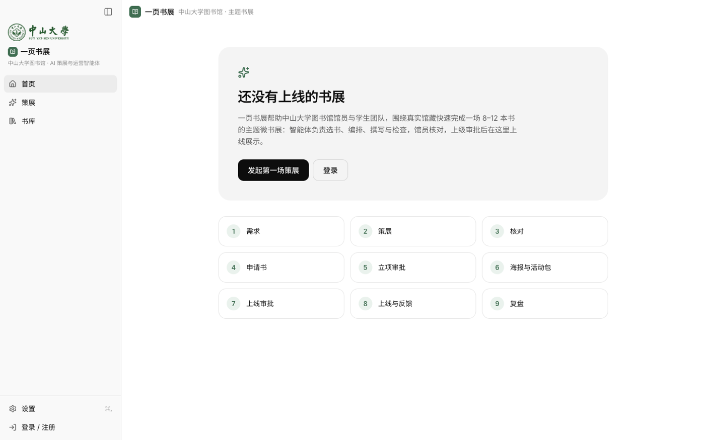

软件内置了一个超级管理员账号，登录框里会提示初始密码。点 **“填入”** 自动填好账号和密码；勾选 **“记住密码”** 后，下次可以一键登录（密码用系统钥匙串加密保存在本机）。点 **“登录”**。

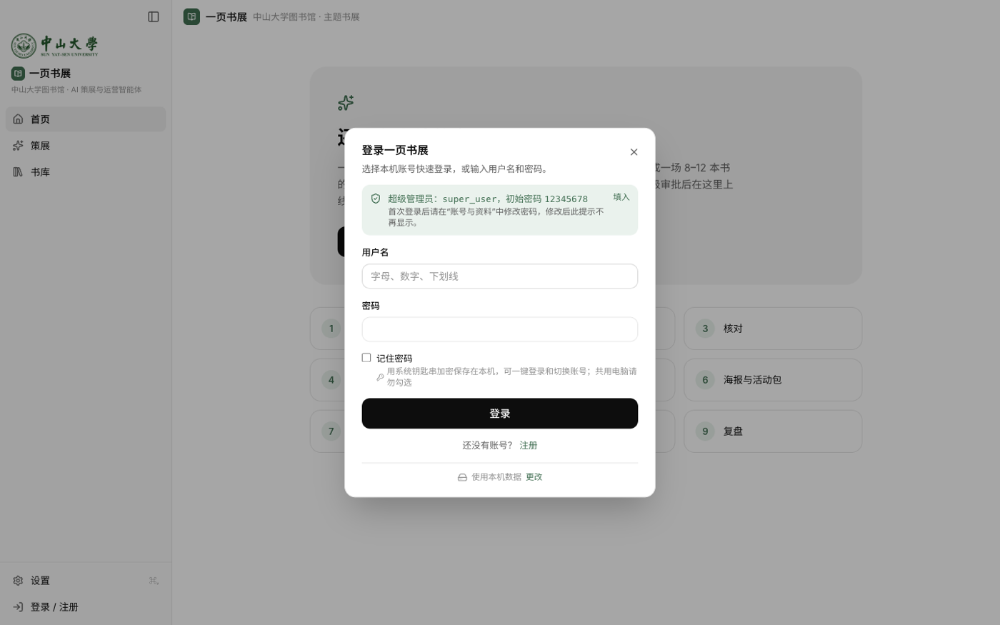

### 3.2 修改初始密码

登录后顶部会提醒“仍在使用初始密码”。点提醒条上的 **“修改密码”**，或进入“设置 › 账号与资料”，填写原密码 `12345678` 和新密码（至少 8 位），点 **“修改密码”**。

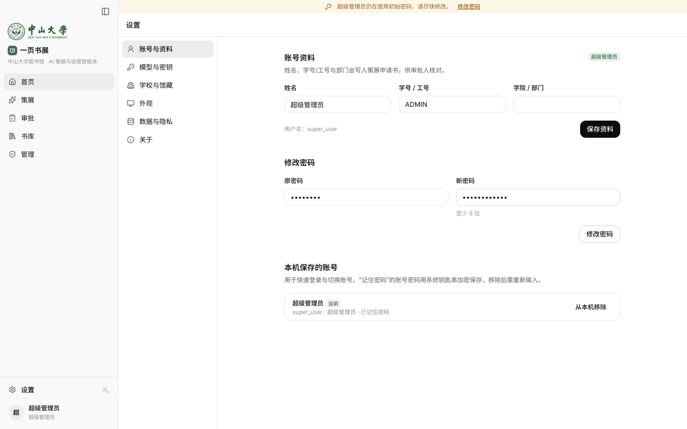

### 3.3 配置大模型（必做）

智能体需要接入一个大模型才能工作。一页书展支持国内外主流服务商（DeepSeek、通义千问、Kimi、智谱、豆包、硅基流动、OpenAI、Gemini 等），也支持本机运行的 Ollama / LM Studio。

**先准备 API Key**：以 DeepSeek 为例，在 <https://platform.deepseek.com> 注册并充值少量余额，在“API Keys”页面创建一个 Key（形如 `sk-…`），复制下来。

1. 点左下角 **“设置”**，选 **“模型与密钥”**，点 **“添加服务商”**。
2. 选择服务商（如 DeepSeek 深度求索），粘贴 API Key。
3. 在“模型”中填写模型名称（如 `deepseek-chat`）后点“添加”，也可以点“从服务商获取”自动拉取。
4. 超级管理员可勾选 **“共享给全部用户”**，这样其他账号不用各自填 Key。
5. 点 **“测试连接”**，看到“连接成功”后点 **“保存”**。

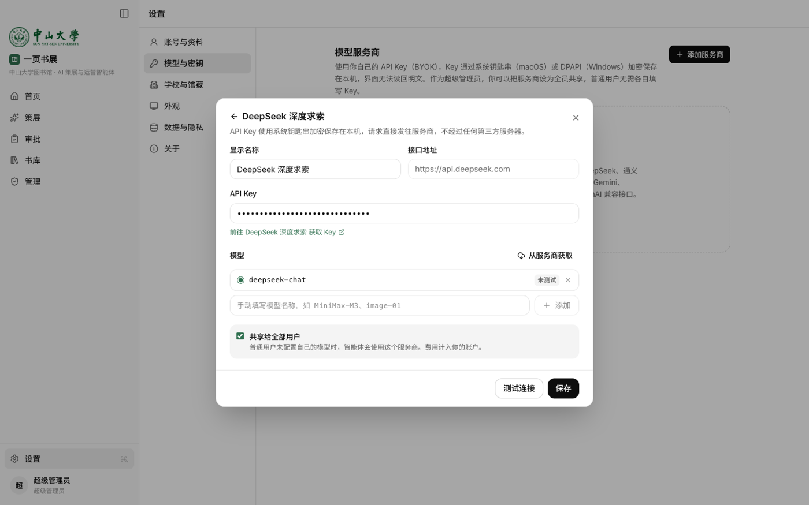

保存后，在下方 **“模型分工”** 中确认“主模型”（负责选书和写作）。如果想让 AI 为海报画一张背景画面，再在 **“生图模型”** 中选一个支持图像生成的模型（如硅基流动的 Kolors、通义万相，或 Gemini 图像模型），可点“测试生图”看看效果。

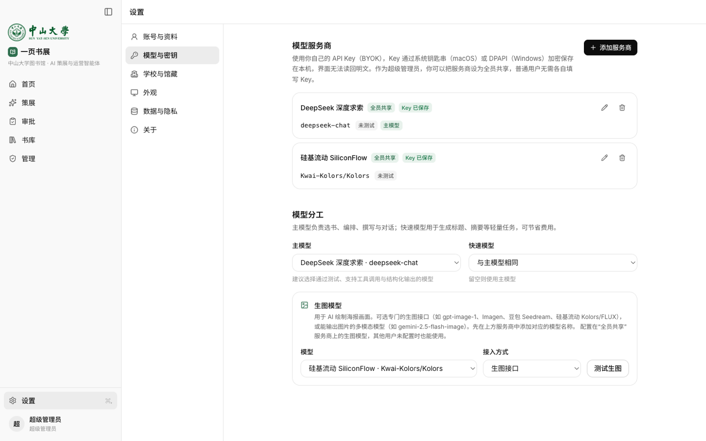

> API Key 只会加密保存，任何人都无法在界面上看到明文。

### 3.4 注册账号、分配审批权限

一期书展通常由“策展人”发起、“审批人”把关。让每位参与者自己注册账号：在登录框中点 **“注册”**，填写用户名、密码、姓名、学号/工号（会写进策展申请书）。新注册的都是普通用户。

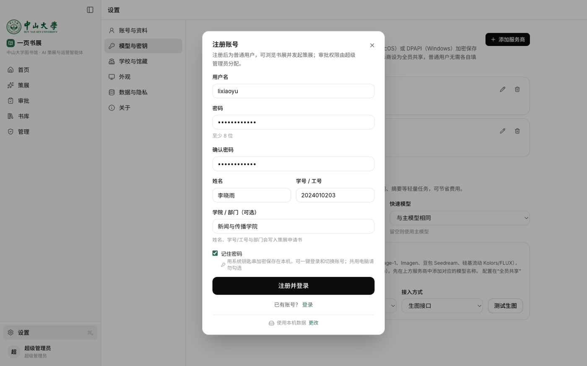

需要审批权限的老师，由超级管理员在左侧 **“管理”** 中，把他的角色改为 **“审批管理员”**。

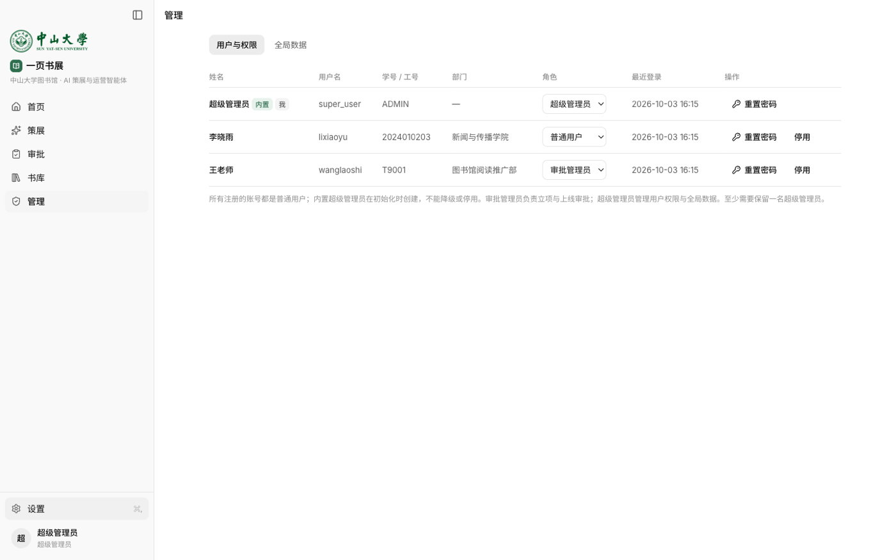

一台电脑上可以登录多个账号。点左下角头像，在菜单中可以直接切换到已记住密码的账号，或“登录其他账号”。

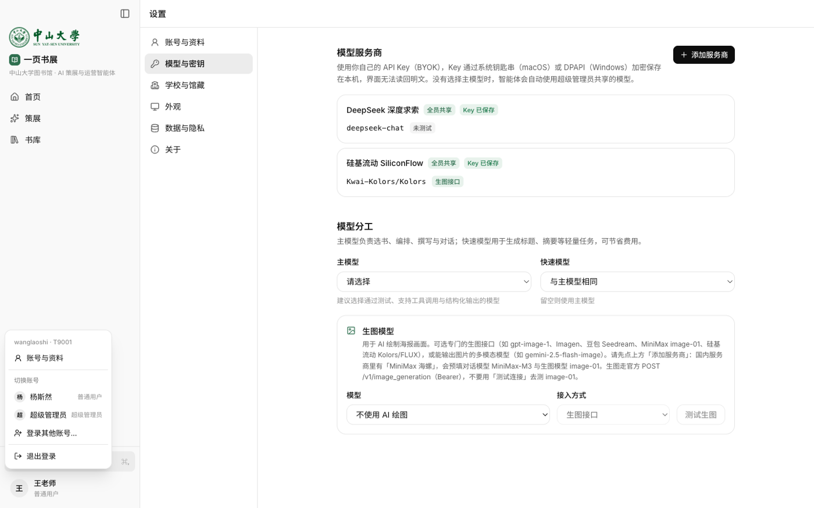

### 3.5 发起策展：填写需求（第 1 步）

以策展人身份登录，点左侧 **“策展”** › **“发起策展”**，填写：

- **主题**：这期书展想讨论的问题，越具体越好；
- **目标读者**、**活动日期 / 时间**、**场地**；
- **期望书目数量**：一般 8–12 本；
- **特殊要求**（可选）：如“兼顾经典与新书”“避开教材”。

点 **“创建并开始策展”**。

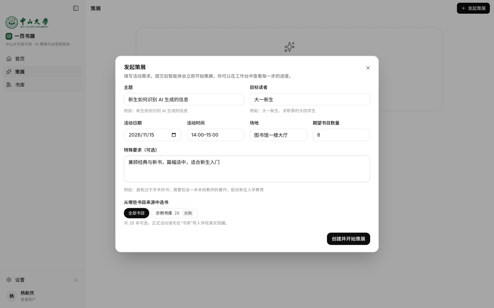

### 3.6 智能体策展与核对清单（第 2、3 步）

智能体会依次完成：整理候选馆藏 → 筛选书目 → 规划展区 → 撰写导读与活动材料 → 检查来源与字段。右侧“智能体运行”面板会实时显示进度，一般一两分钟完成。

完成后进入 **核对清单**：智能体只会从书库中选书，并把需要人工确认的地方列出来，例如重复的书、缺少的字段、示例数据等。

- 标红的“必须处理”项要先处理：点“已处理”，或写明理由后“忽略”；
- 可以直接修改展区标题、导读文字，或点“替换”换一本书；
- 处理完后点 **“确认无误，生成策展申请书”**。

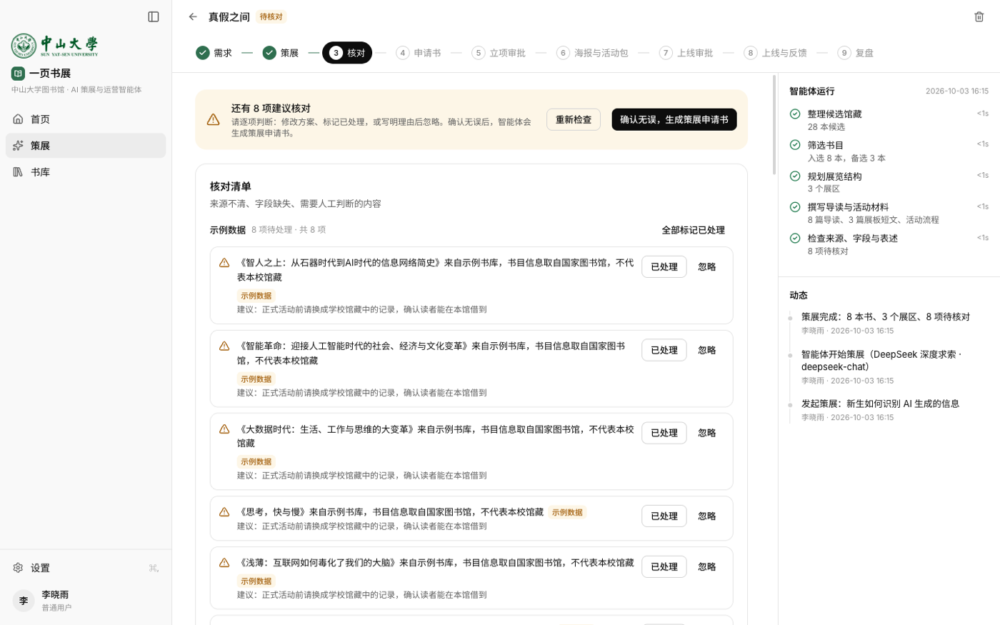

### 3.7 策展申请书与立项审批（第 4、5 步）

智能体会生成一份正式的 **策展申请书**：主题、形式、申请人、书单、目的、预期成果、所需支持。可以直接修改其中的文字，也可以导出为文件。确认后点 **“提交立项审批”**。

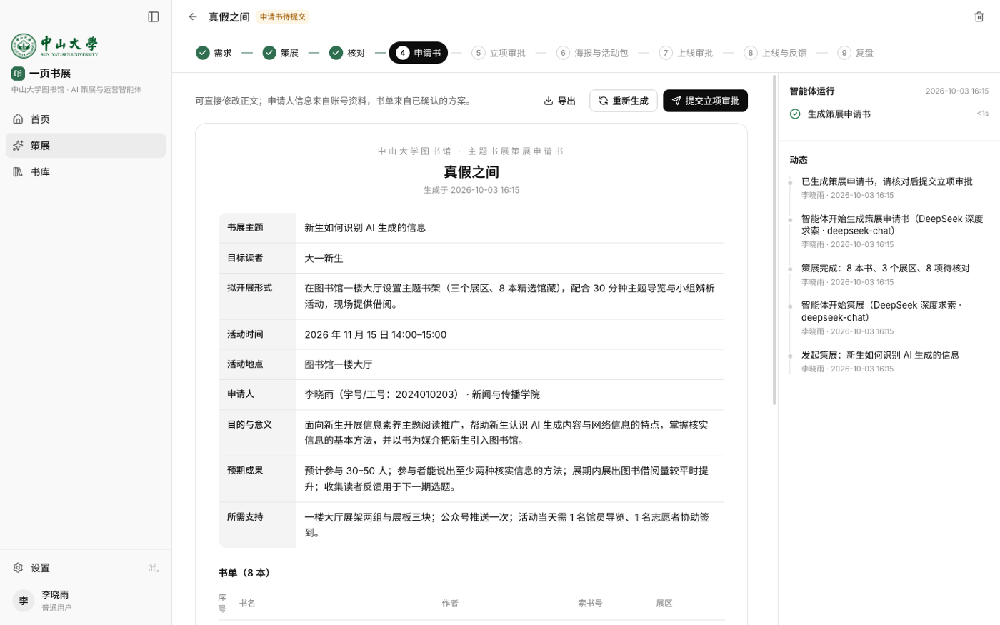

**审批人**登录后，点左侧 **“审批”**，打开待审批的书展，阅读申请书后填写意见，点 **“同意”**；如需修改则点“退回修改”，策展人会看到意见并修改后重新提交。

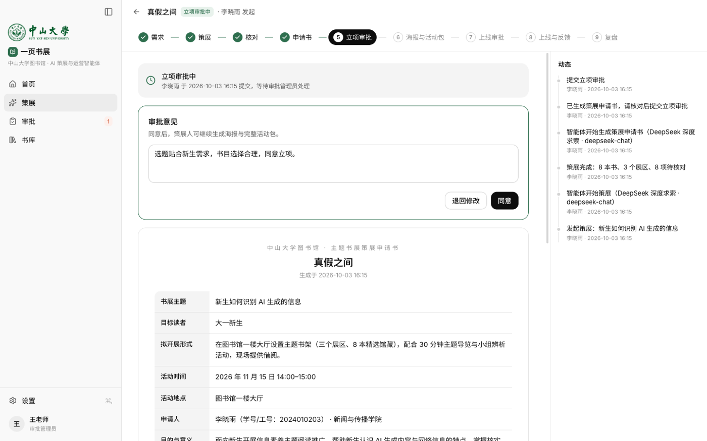

### 3.8 海报与活动包（第 6 步）

立项通过后，策展人点 **“生成海报与完整活动包”**，智能体会写好海报文案、公众号推文、报名介绍、校园通知和反馈问卷。

- 海报有多种模板可选，点 **“导出 PNG”** 保存图片；
- 配置了生图模型时，可以选一种画风（水彩、版画、国风水墨……），点 **“AI 绘制画面”**，海报会换成 AI 画的背景，标题和时间地点由模板排版，文字不会出错。


往下滚动可以看到推文、报名介绍等全部材料，每一段都可以修改，也可以一键导出完整活动包。

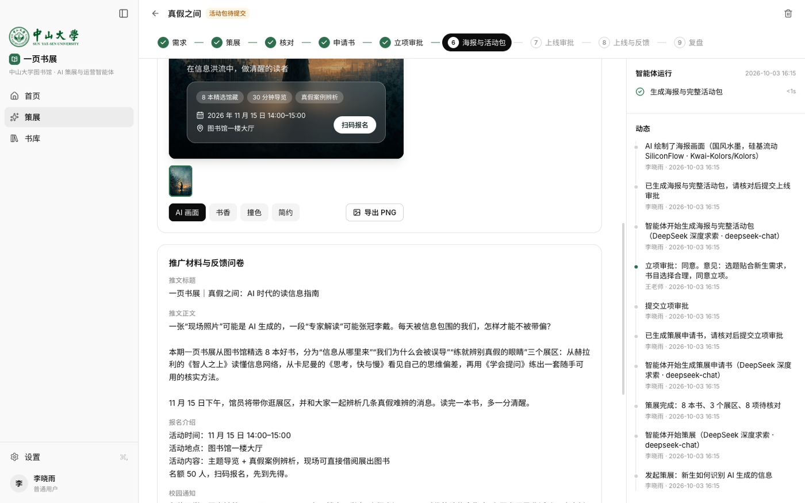

确认后点 **“提交上线审批”**，审批人同意后书展就会发布到首页（第 7 步）。

### 3.9 首页展示（发布后）

所有人打开软件都会先看到最新一期书展：海报、活动时间地点、倒计时、展区与书目导读。鼠标移到海报上会有立体倾斜效果；点任意一本书，可以看到它的导读、入选理由和完整书目信息。

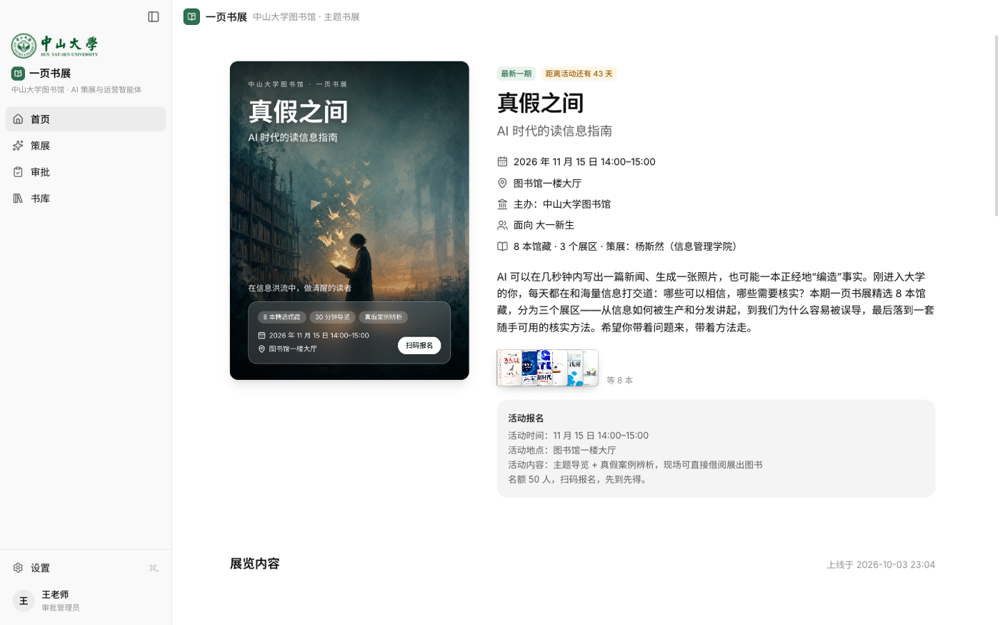

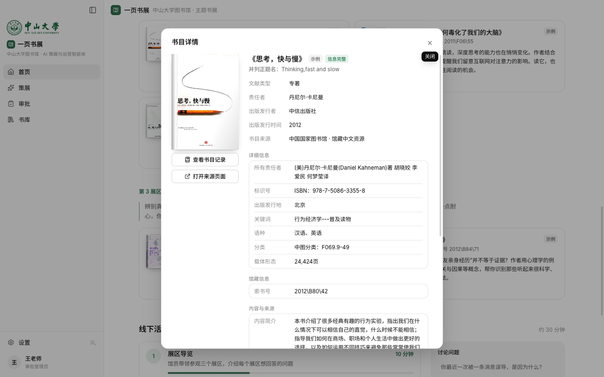

### 3.10 上线与反馈、复盘（第 8、9 步）

活动结束后，策展人在书展页面的 **“上线与反馈”** 中：

1. 填写参与人数等执行记录，点“保存”；
2. 把收集到的反馈粘贴进来，每行一条，开头写评分（如“5 很有收获”或“4分：希望多些练习”），点 **“录入反馈”**。手机号、邮箱等个人信息会自动隐去。

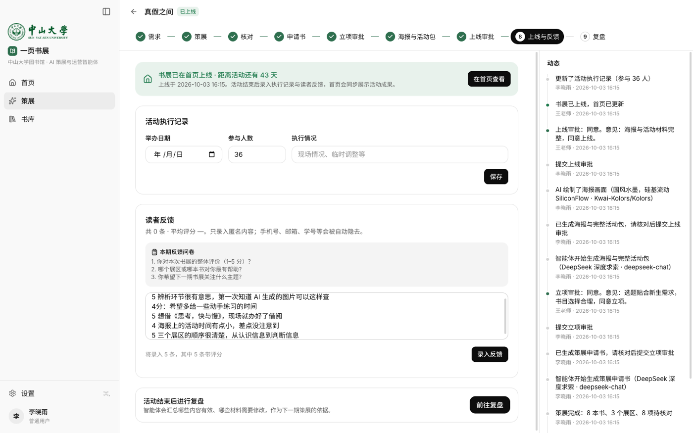

点 **“前往复盘”** › **“生成复盘总结”**，智能体会总结有效做法、需要改进的地方和给下一期的建议。这些建议会自动作为之后策展的参考。

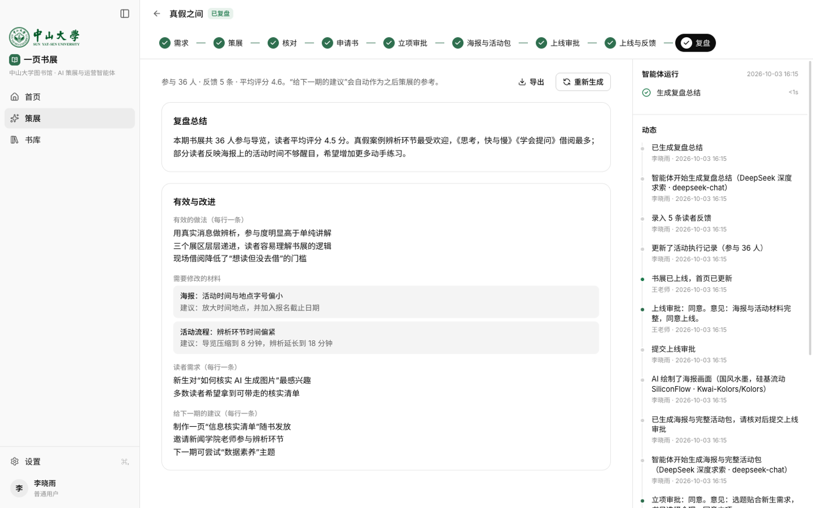

首页也会展示本期的活动成果：参与人数、反馈与评分、精选好评。

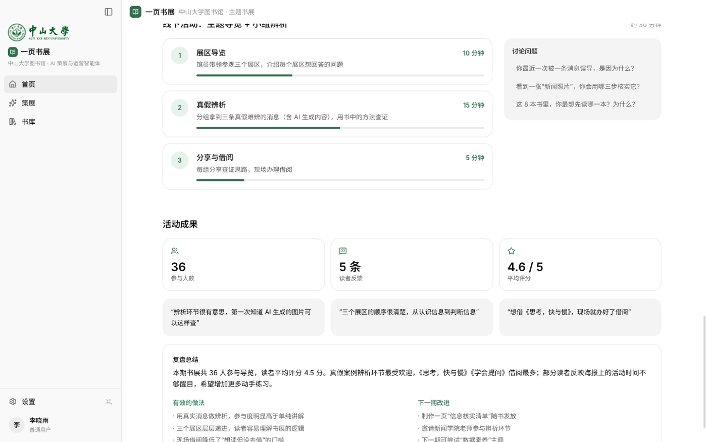

### 3.11 书库

左侧 **“书库”** 管理所有可选的图书。内置的“示例书库”有 27 本真实图书，书目信息与索书号来自国家图书馆。

- **列表视图**：点任意一本书展开详情：封面、ISBN、出版信息、中图分类号、载体形态、索书号、内容简介等。

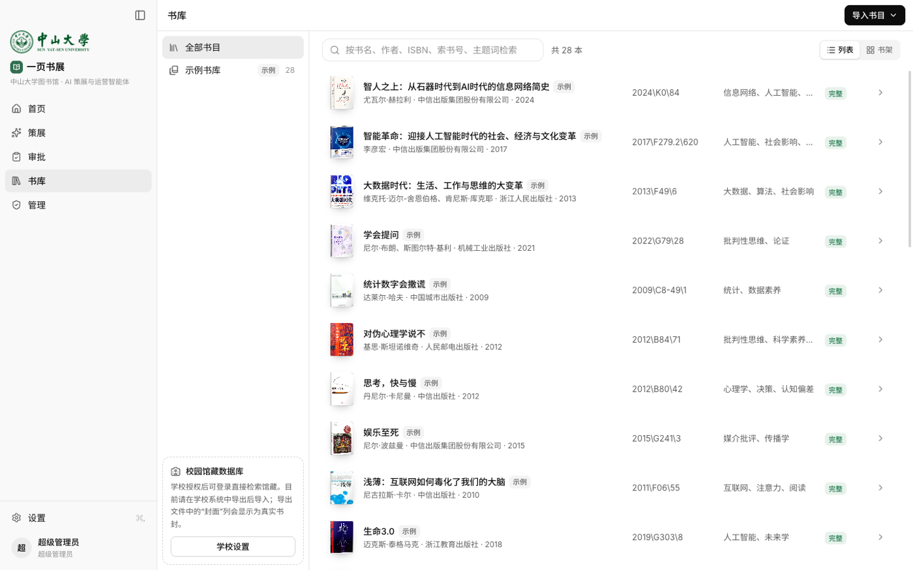

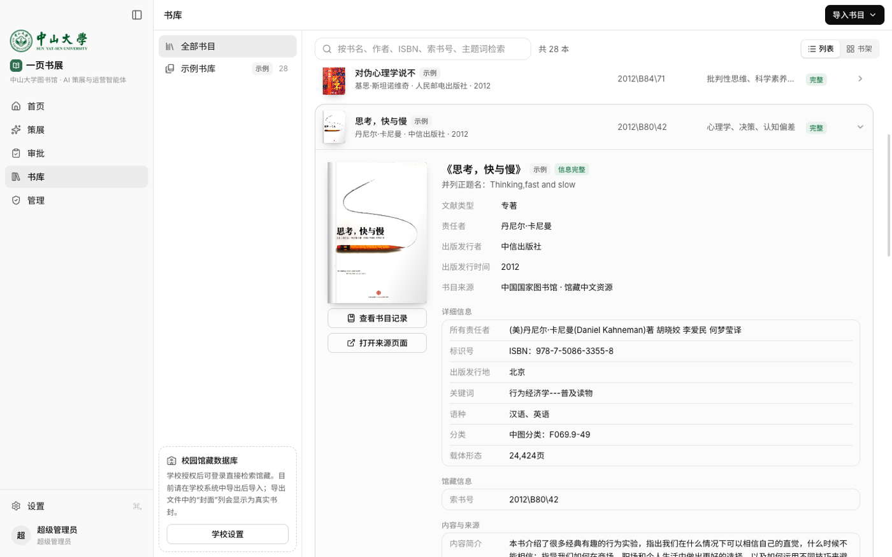

- **书架视图**：以封面浏览，点封面打开详情。

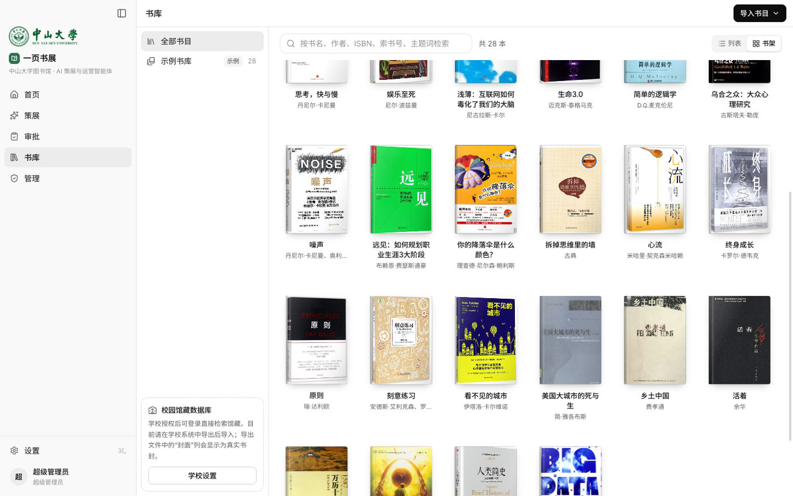

- **导入学校馆藏**：点右上角 **“导入书目”**，可以导入从学校图书馆系统导出的 Excel / CSV / TXT / JSON 文件，表头会自动识别（书名、作者、ISBN、索书号、中图分类号等）；也可以 **“粘贴文本”**，直接粘贴少量检索结果。

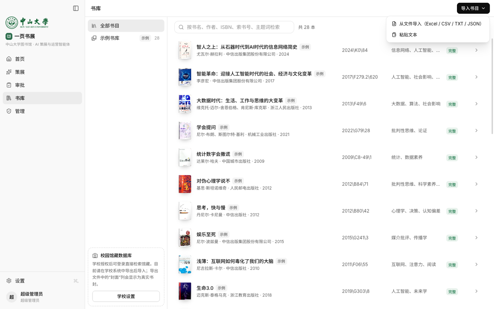

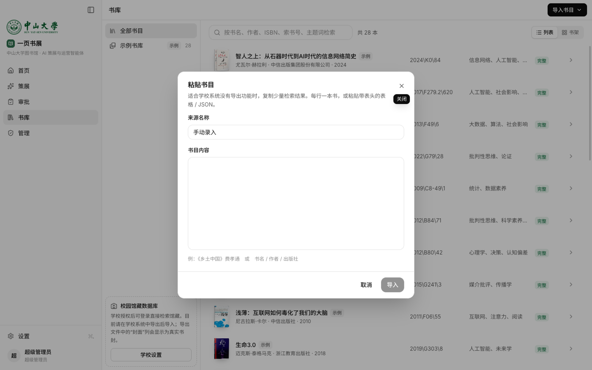

### 3.12 其他设置

- **外观**：浅色 / 深色 / 跟随系统。
- **学校与馆藏**：修改学校名称、图书馆名称（会显示在侧栏、海报和申请书中）。
- **数据与隐私**：查看数据保存位置、更改连接方式。

---

## 四、连接团队服务器

多人协作时，由一位管理员部署服务器，其他人在客户端里连接即可。

### 4.1 向服务器管理员要三样信息

| 项目 | 示例 |
| --- | --- |
| 服务器地址 | `https://203.0.113.10`（服务器的公网 IP 或域名） |
| 证书指纹（SHA-256） | 形如 `C0:22:97:2B:…:FF:4A` 的 32 组字符，部署服务器时会输出 |
| 初始超级管理员 | 用户名 `super_user`，初始密码由服务器管理员提供 |

> 服务器管理员查看初始密码：`ssh <用户名>@<服务器IP> 'sudo cat /var/lib/yiyeshuzhan/initial-admin-password.txt'`。首次登录后会要求修改。

### 4.2 连接服务器（每位用户在自己电脑上操作一次）

1. 打开软件，点左下角 **“登录 / 注册”**，在登录框最下方“使用本机数据”旁点 **“更改”**（也可以在“设置 › 数据与隐私 › 连接”中点“更改连接”）。
2. 选择 **“团队服务器”**，填写服务器地址，点 **“测试连接”**。
3. 下方会显示服务器名称和 **证书指纹**。**逐段核对**是否与管理员提供的指纹一致——一致才说明连上的是真正的学校服务器。
4. 点 **“信任并连接”**。软件会重新加载，左下角出现“已连接服务器”。

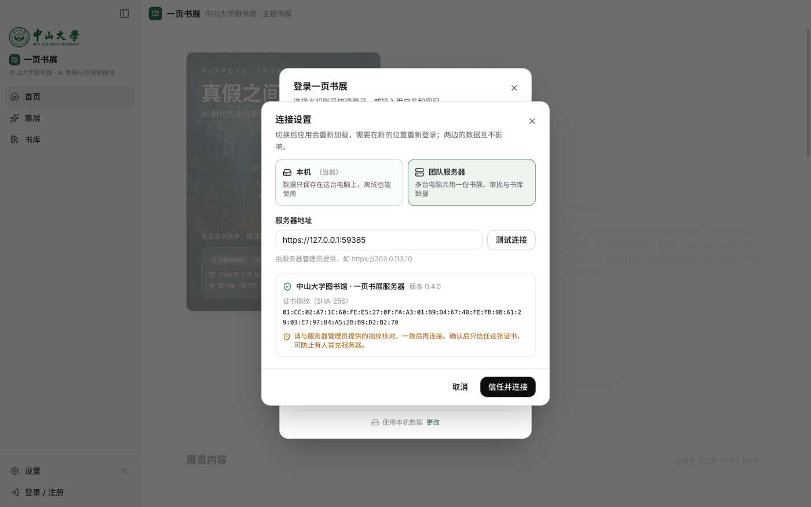

> 证书指纹的作用：服务器使用的是自签名证书，确认一次指纹后，软件只信任这张证书，即使有人冒充服务器也连不上。如果以后提示“服务器证书与之前确认的不一致”，请先联系服务器管理员确认。

### 4.3 登录与使用

连接后用法与本机完全相同：

- 第一次连接时，超级管理员用 `super_user` 和初始密码登录，并按提示修改密码；
- 其他人点“注册”创建自己的账号，再由超级管理员分配角色；
- 超级管理员在“设置 › 模型与密钥”中添加服务商并勾选 **“共享给全部用户”**，大家就都能使用智能体，API Key 加密保存在服务器上，任何客户端都看不到明文。

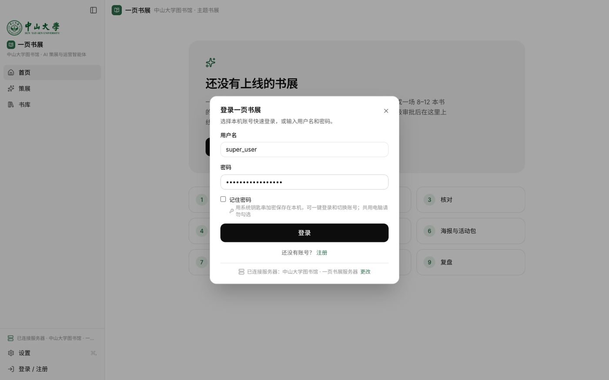

“记住密码”只保存在你自己的电脑上；本机和服务器的账号分开记住，互不影响。

在“设置 › 数据与隐私”中可以看到当前连接的服务器，也可以随时 **“更改连接”** 切回本机。

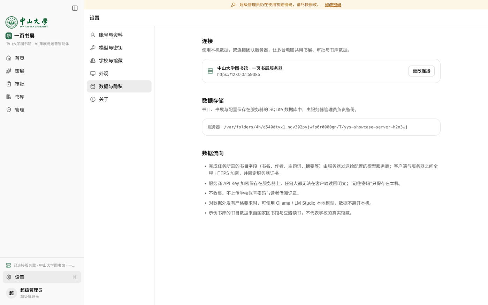

### 4.4 给服务器管理员：部署与维护

服务器要求：Linux（已在 Ubuntu 26.04 验证），4 核 4G 足够测试与演示。在开发电脑上执行：

```bash
deploy/deploy.sh ubuntu@服务器IP
```

脚本会自动安装 Node.js、生成证书、启动服务，并输出证书指纹。云服务器需在控制台的防火墙中放行 TCP 443。

- 查看运行日志：`sudo journalctl -u yiyeshuzhan -f`
- 备份数据：备份服务器上的 `/var/lib/yiyeshuzhan` 目录
- 更新版本：重新执行一次 `deploy.sh`

---

## 五、常见问题

**Q：点“测试连接”提示连接超时？**
检查服务器地址是否以 `https://` 开头；确认服务器防火墙放行了 443 端口。公司或学校网络的安全软件（如 iOA）有时会拦截到服务器的连接，可以换手机热点试试。

**Q：智能体运行失败，提示“还没有配置模型”或“鉴权失败”？**
到“设置 › 模型与密钥”检查服务商的 API Key 是否正确、账户是否有余额，并点“测试连接”。普通用户也可以请超级管理员配置“共享给全部用户”的服务商。

**Q：核对清单里提示“缺少索书号”“来自示例书库”？**
索书号是读者在书架上找书的依据，书目缺少索书号时会提示，可以在学校系统导出时带上“索书号”列重新导入。示例书库中有两本书故意不带索书号，用来演示核对清单。“来自示例书库”是提醒示例书目不代表本校馆藏，正式活动前换成学校馆藏中的书即可；确认无误的可以“已处理”。

**Q：忘记密码怎么办？**
请超级管理员在“管理”中为你重置密码。超级管理员忘记密码时：本机模式可删除数据目录后重新初始化（会清空数据）；服务器模式请联系服务器管理员。

**Q：数据保存在哪里？如何备份？**
本机模式在“设置 › 数据与隐私”中点“打开数据目录”，复制整个文件夹即可备份。服务器模式由服务器管理员备份。

**Q：本机和服务器上的书展能互相转移吗？**
目前两边的数据互相独立。可以把书展的申请书、活动包导出为文件保存。
